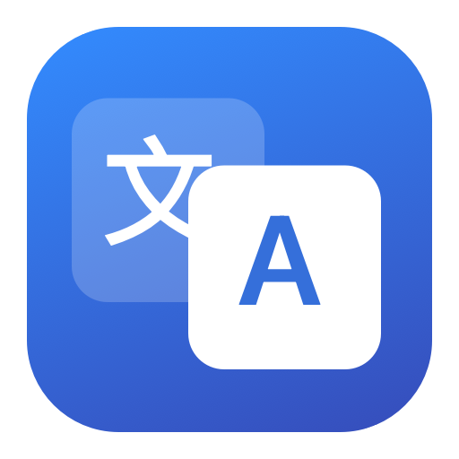

<p align="center"></p>
<h1 align="center">啾译 · JiuyiTranslate</h1>
<p align="center">选中文字，按 ⌥D。用 Apple 系统翻译，轻松中英互译。</p>

轻量原生 macOS 翻译工具，无需注册账户或配置 API Key。提供原文与译文一体的浮窗，适合阅读英文网页、文档和代码中的单词。

> **当前为 v1.5.0 预览版，使用临时签名，尚未经过 Apple 公证。** 首次打开可能被 macOS 阻止；请先阅读下方安装说明。本项目不是 Bob 的官方版本，与 Bob 无关联。

## 下载与安装

<!-- download-links -->
从本仓库右侧 **Releases** 下载 `JiuyiTranslate-版本号-macOS-universal.dmg`，不要下载 GitHub 自动生成的 Source code 压缩包。
<!-- /download-links -->

- **系统要求**：macOS 15 或更高版本。
- **架构**：Universal 包含 Apple silicon（M 系列）和 Intel 两种架构；日常功能在 Apple silicon 上验证，Intel 尚未实机验证。
- **语言**：仅中文和英语；首次翻译可能需要联网下载 Apple 语言包。

1. 打开 DMG，将 **啾译.app** 拖入旁边的 **Applications（应用程序）** 文件夹。
2. 从“应用程序”打开软件，随后可推出 DMG。不要一直在安装镜像内运行。
3. 若提示无法验证开发者，确认文件来自本仓库后，按照 [Apple 官方说明](https://support.apple.com/zh-cn/102445) 在“系统设置 → 隐私与安全性”中处理“仍要打开”。不需要关闭系统安全保护。
4. 在菜单栏的翻译图标中选择 **授权辅助功能**，允许“啾译”读取已选中文字。只使用手动输入、粘贴翻译时无需该权限。
5. 在其他应用中选中文字，按 **⌥D（Option + D）**，松开按键，等待译文。

ZIP 包可用于不便打开 DMG 的情况：解压后同样把应用放入“应用程序”。Release 中的 `.sha256` 文件可用于验证下载是否完整，详见[安装与故障排查](docs/INSTALL.md)。

## 能做什么

| 功能 | 使用方式 |
| --- | --- |
| 划词翻译 | 选中文字后按 ⌥D；辅助功能取词失败时尝试复制取词 |
| 手动翻译 | 菜单栏 → 输入文字翻译，或设置 → 输入文字翻译；支持 ⌘V |
| 中英互译 | 含汉字默认译为英语，其余默认译为简体中文；可手动指定方向 |
| 阅读译文 | 随内容展开，到屏幕高度上限后滚动；支持折叠、复制和朗读 |
| 浮窗 | 图钉切换置顶，拖动顶部移动，Esc 或 × 关闭 |
| 隐藏菜单栏图标 | 在设置关闭图标后，⌥D 仍可使用 |
| 登录时自动启动 | 设置中启用，按系统要求批准登录项 |
| 离线帮助 | 翻译窗口右上角齿轮 → 使用帮助 |

应用不提供截图 OCR、其他语种、翻译历史、账户系统或自动更新。`street`、`streetEmpty` 等无汉字文本按英语处理，不会因自动识别误判而请求其他语种语言包。

## 常见问题

**在哪里下载语言包？**

“系统设置 → 通用 → 语言与地区 → 翻译语言”，下载英语和中文（简体）。也可按第一次翻译的系统提示下载。详细步骤见 [Apple 官方说明](https://support.apple.com/zh-cn/guide/mac-help-cn/mchldd8b3c15/mac)。

**网页里取不到文字？**

先用鼠标选中网页文字，再按 ⌥D 并松开。取词期间不要切换应用或另行复制。程序优先读取辅助功能选区，失败后发送一次 ⌘C 尝试读取选区；受限制网页、图片或扫描 PDF 仍可能无法取词。也可先复制，然后在翻译框粘贴。

**已经授权，为什么还提示未授权？**

确认授权的是“应用程序”中实际运行的这一份。临时签名版本升级后，旧授权可能失效：从辅助功能列表移除旧条目，重新添加当前应用、开启权限，然后退出重启。翻译提示页的“定位当前应用”可帮助排查同名副本。

**隐藏图标后怎么找回？**

按 ⌥D 打开浮窗，再点右上角齿轮；也可以再次双击正在运行的应用打开设置。隐藏图标不会退出应用，自启动开关独立设置。

**新版本下载后看起来没变化？**

先从软件设置中退出旧进程，再替换“应用程序”里的 `.app`。重新打开后，在设置底部确认版本号。不要同时保留并运行多个位置的同名应用。

**如何反馈问题？**

在仓库 **Issues** 新建问题，提供 macOS 版本、芯片型号、应用版本、使用的浏览器或软件，以及复现步骤。截图请遮挡私人信息，不要上传密码、令牌或私人剪贴板内容。

更多说明：[安装与故障排查](docs/INSTALL.md) · [隐私与权限](docs/PRIVACY.md) · [开发与发布](docs/DEVELOPMENT.md) · [更新记录](CHANGELOG.md)

## 隐私与权限

应用不加入广告、遥测、分析 SDK、第三方翻译 API 或翻译内容日志，不保存翻译历史。翻译和语言包由 Apple Translation 框架处理；Apple 系统服务的行为遵循其自身设置与政策。

复制取词会短暂使用剪贴板并尝试恢复原内容，剪贴板管理器可能记录中间内容。遇到切换应用、后续复制或超时等情况，无法保证恢复；详细边界见[隐私说明](docs/PRIVACY.md)。

## 从源码构建

需要 macOS 15+、Xcode 16+（Swift 6 和 macOS SDK）。无第三方 Swift 依赖。

```bash
bash scripts/build.sh
open "dist/啾译.app"
```

生成 Universal DMG、ZIP 与校验文件：

```bash
bash scripts/package.sh
```

产物在 `dist/`，不会提交进源码仓库。GitHub Actions 可自动检查构建，并在版本标签推送后创建预览 Release 草稿，详情见[发布文档](docs/DEVELOPMENT.md)。
